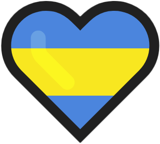
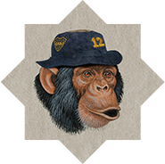

<p align="left">
    
</p>

# Proyecto Personal | [**To-Do List**](https://to-do-list-insa.vercel.app/)

<p align="center">
  
</p>

<div align="center">

## **📌 TECNOLOGÍAS UTILIZADAS**


[](https://vercel.com/)

</div>

---

<div align="center">

## **📋 DESCRIPCIÓN**

</div>

Una aplicación web simple de lista de tareas donde los usuarios pueden agregar tareas a su lista y marcarlas como completadas. Esta aplicación proporciona una forma fácil de gestionar las tareas diarias y mantenerse organizado.

---

<div align="center">

## **📁 DETALLES**

</div>

La aplicación está construida con HTML, CSS y JavaScript, y cuenta con:

**📝 Gestión de Tareas**

- Agregar tareas a la lista de tareas pendientes.
- Marcar tareas como completadas.
- Eliminar tareas de la lista.

---

<div align="center">

## **⚙️ INSTRUCCIONES DE USO**

</div>

Sigue estos pasos para ejecutar el proyecto de manera local:

1. **Clonar el repositorio**:
   ```bash
   git clone https://github.com/Insaurralde38/To-Do-List.git
   cd To-Do-List
   ```

2. **Ejecutar el proyecto**:
   Usa una extensión como [Live Server](vscode:extension/ritwickdey.LiveServer) o [Live Preview](vscode:extension/ms-vscode.live-server) en Visual Studio Code para ejecutar el archivo `index.html`. Alternativamente, puedes usar cualquier servidor web local.

---

<div align="end">

Hecho con  por [**DIEGO INSAURRALDE**](https://insaurralde.vercel.app/) 

</div>